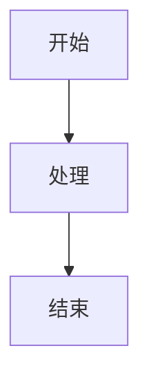

# markdown_spec.md

# MarkdownEditor Markdown 语法与编辑行为规范

## 0. 规范目标

本文档定义 MarkdownEditor 第一阶段支持的 Markdown 语法、编辑行为、序列化规则、图片路径规则和测试边界。

核心原则：

1. 第一阶段优先支持 CommonMark/GFM 常用语法。
2. 语法支持要可测试，不追求一次性覆盖所有扩展语法。
3. Markdown 加载和保存后必须保持语义结构稳定。
4. 不强制保留所有原始空格和换行格式，但不能破坏文档含义。
5. 图片必须优先使用相对路径，保证文件夹迁移后仍可用。

---

## 1. 语法支持总表

| 语法 | 示例 | 第一阶段 | 说明 |
|---|---|---:|---|
| 段落 | `普通文本` | 必须 | 基础文本 |
| 标题 | `# 标题` | 必须 | 支持 h1-h6 |
| 加粗 | `**bold**` | 必须 | 支持快捷键 |
| 斜体 | `*italic*` | 必须 | 支持快捷键 |
| 删除线 | `~~text~~` | 应该 | GFM |
| 行内代码 | `` `code` `` | 必须 | 基础 |
| 代码块 | 三反引号 | 必须 | 支持语言标识和高亮 |
| 引用 | `> quote` | 必须 | 支持多行引用 |
| 无序列表 | `- item` | 必须 | 支持嵌套 |
| 有序列表 | `1. item` | 必须 | 支持自动延续 |
| 任务列表 | `- [ ] task` | 应该 | GFM |
| 链接 | `[text](url)` | 必须 | 支持本地和远程链接 |
| 图片 | `` | 必须 | 支持相对路径 |
| 表格 | GFM table | 必须 | 第一阶段支持基础编辑 |
| 分割线 | `---` | 必须 | 渲染为 hr |
| 数学公式 | `$x$` / `$$x$$` | 应该 | KaTeX |
| Mermaid | ```mermaid | 可选 | 第二阶段也可做 |
| Front Matter | `--- yaml ---` | 可选 | 保留，不强编辑 |
| 脚注 | `[^1]` | 暂不做 | 后置 |
| 自定义容器 | `::: note` | 暂不做 | 后置 |
| HTML | `<div>` | 只读保留 | 不保证可视化编辑 |

---

## 2. 标题规范

### 2.1 支持范围

```md
# 一级标题
## 二级标题
### 三级标题
#### 四级标题
##### 五级标题
###### 六级标题
```

### 2.2 编辑行为

| 输入 | 行为 |
|---|---|
| 行首输入 `# ` | 转为一级标题 |
| 行首输入 `## ` | 转为二级标题 |
| 标题行按 Enter | 新建普通段落 |
| 标题行 Backspace 删除所有文本 | 保留空标题或转普通段落，由编辑器能力决定 |
| 大纲点击标题 | 编辑器滚动到对应位置 |

### 2.3 序列化规则

- 标题必须序列化为 ATX heading，即 `#` 形式。
- 不使用 Setext heading，即下划线形式。

---

## 3. 段落和换行

### 3.1 段落

普通文本作为段落处理。

```md
这是第一段。

这是第二段。
```

### 3.2 软换行和硬换行

| 输入 | 结果 |
|---|---|
| Enter | 新段落 |
| Shift+Enter | 段内换行 |

### 3.3 序列化规则

- 段落之间保留一个空行。
- 段内硬换行可序列化为 `<br>` 或两个空格加换行，第一版建议使用 `<br>` 降低歧义。

---

## 4. 强调、加粗、删除线

### 4.1 示例

```md
*斜体*
**加粗**
***加粗斜体***
~~删除线~~
```

### 4.2 编辑行为

| 快捷键 | 行为 |
|---|---|
| Ctrl+B | 切换加粗 |
| Ctrl+I | 切换斜体 |
| Ctrl+Shift+X | 切换删除线，可选 |

### 4.3 序列化规则

- 加粗统一使用 `**text**`。
- 斜体统一使用 `*text*`。
- 删除线统一使用 `~~text~~`。

---

## 5. 列表规范

### 5.1 无序列表

```md
- 项目 A
- 项目 B
  - 子项目 B1
  - 子项目 B2
```

### 5.2 有序列表

```md
1. 第一项
2. 第二项
3. 第三项
```

### 5.3 任务列表

```md
- [ ] 未完成任务
- [x] 已完成任务
```

### 5.4 编辑行为

| 场景 | 行为 |
|---|---|
| 列表项末尾按 Enter | 自动新增下一项 |
| 空列表项按 Enter | 退出列表 |
| Tab | 增加缩进 |
| Shift+Tab | 减少缩进 |
| 输入 `- [ ] ` | 转任务列表 |

### 5.5 序列化规则

- 无序列表统一使用 `-`。
- 有序列表可以重新编号为 `1. 2. 3.`。
- 嵌套缩进使用两个空格或四个空格，第一版统一两个空格。

---

## 6. 引用块

### 6.1 示例

```md
> 这是一段引用。
> 这是引用的第二行。
```

### 6.2 编辑行为

| 场景 | 行为 |
|---|---|
| 行首输入 `> ` | 转为引用块 |
| 引用块末尾 Enter | 延续引用 |
| 空引用行 Enter | 退出引用 |

### 6.3 序列化规则

- 每行前加 `>`。
- 引用内可包含段落、列表、代码等嵌套内容，但第一阶段不强求复杂嵌套完美编辑。

---

## 7. 代码规范

### 7.1 行内代码

```md
这里有一段 `inline code`。
```

### 7.2 代码块

````md
```ts
const message = 'hello';
console.log(message);
```
````

### 7.3 编辑行为

| 场景 | 行为 |
|---|---|
| 输入三反引号 | 创建代码块 |
| 代码块内按 Tab | 插入缩进，不切焦点 |
| 代码块内粘贴代码 | 保留换行和缩进 |
| 语言标识 | 支持手动输入或下拉选择，可后置 |

### 7.4 序列化规则

- 代码块统一使用 fenced code block。
- 默认围栏使用三反引号。
- 若代码内容包含三反引号，需要自动提升围栏长度。

---

## 8. 表格规范

### 8.1 示例

```md
| 名称 | 说明 | 状态 |
|---|---|---|
| 标题 | 支持 h1-h6 | 完成 |
| 表格 | 基础编辑 | 开发中 |
```

### 8.2 支持范围

第一阶段支持：

1. 创建表格。
2. 编辑单元格文本。
3. 添加行。
4. 删除行。
5. 添加列。
6. 删除列。
7. 基础对齐显示。

第一阶段不强制支持：

1. 合并单元格。
2. 单元格内复杂块级内容。
3. Excel 式公式。
4. 复杂表格拖拽调整。

### 8.3 对齐

```md
| 左对齐 | 居中 | 右对齐 |
|:---|:---:|---:|
| A | B | C |
```

### 8.4 序列化规则

- 表格必须输出标准 GFM 表格。
- 单元格中的 `|` 需要转义为 `\|`。
- 空单元格保留为空字符串。

---

## 9. 链接规范

### 9.1 普通链接

```md
[OpenAI](https://openai.com)
```

### 9.2 本地链接

```md
[另一个文档](./other.md)
```

### 9.3 编辑行为

| 场景 | 行为 |
|---|---|
| Ctrl+点击链接 | 打开链接 |
| 普通点击 | 移动光标或选中链接文本 |
| 粘贴 URL | 可选：自动转为链接 |

### 9.4 序列化规则

- 普通链接使用 inline link 形式。
- 第一阶段不强制支持 reference link 的可视化编辑。
- 已存在 reference link 应尽量保留，不保证无损。

---

## 10. 图片规范

### 10.1 基础语法

```md

```

### 10.2 图片路径原则

1. 优先使用相对路径。
2. 拖拽/粘贴图片统一复制到当前文档 `.assets` 目录。
3. 不默认使用绝对路径。
4. 不默认上传图床。

### 10.3 目录规则

当前文档：

```text
/notes/my-note.md
```

图片目录：

```text
/notes/my-note.assets/
```

插入路径：

```md

```

### 10.4 编辑行为

| 场景 | 行为 |
|---|---|
| 拖拽图片到已保存文档 | 复制到 `.assets` 并插入图片 |
| 拖拽图片到未保存文档 | 提示先保存文档 |
| 粘贴剪贴板图片 | 复制到 `.assets` 并插入图片 |
| 图片文件不存在 | 显示缺失占位 |
| 点击图片 | 选中图片节点 |

### 10.5 支持格式

| 格式 | 支持 |
|---|---:|
| png | 是 |
| jpg/jpeg | 是 |
| gif | 是 |
| webp | 是 |
| svg | 是，但需安全处理 |
| bmp | 可选 |

---

## 11. 数学公式规范

### 11.1 行内公式

```md
这是行内公式 $E=mc^2$。
```

### 11.2 块级公式

```md
$$
E=mc^2
$$
```

### 11.3 编辑行为

| 场景 | 行为 |
|---|---|
| 输入 `$...$` | 渲染为行内公式 |
| 输入 `$$` | 创建块级公式 |
| 双击公式 | 进入源码编辑 |
| 公式错误 | 显示错误提示，不删除源码 |

### 11.4 序列化规则

- 行内公式保留 `$...$`。
- 块级公式保留 `$$...$$`。
- 渲染失败不得破坏原始公式文本。

---

## 12. Mermaid 规范

### 12.1 示例

````md

````

### 12.2 支持范围

第一阶段可支持：

1. flowchart。
2. sequenceDiagram。
3. classDiagram。
4. pie。

### 12.3 编辑行为

| 场景 | 行为 |
|---|---|
| 代码块语言为 mermaid | 渲染 Mermaid 图 |
| 图表错误 | 显示错误提示和源码入口 |
| 双击图表 | 进入源码编辑 |

---

## 13. Front Matter

### 13.1 示例

```md
---
title: 文档标题
tags:
  - note
  - markdown
---

# 正文
```

### 13.2 第一阶段策略

- 可以识别和保留。
- 不做复杂可视化编辑。
- 不应把 Front Matter 当作分割线处理。

---

## 14. HTML 处理

### 14.1 策略

Markdown 中的 HTML 第一阶段按“保留优先”处理。

```md
<div class="note">
  自定义 HTML
</div>
```

### 14.2 限制

1. 不保证 HTML 内容可视化编辑体验。
2. 不执行危险脚本。
3. 导出 HTML 时需要安全过滤或明确沙箱策略。

---

## 15. 粘贴规则

### 15.1 粘贴纯文本

- 按普通 Markdown 文本插入。
- 保留基本换行。

### 15.2 粘贴 HTML

优先转换为 Markdown：

| HTML | Markdown |
|---|---|
| `<h1>` | `#` |
| `<strong>` | `**` |
| `<em>` | `*` |
| `<a>` | `[text](url)` |
| `` | `` |
| `<table>` | GFM table，可后置 |

### 15.3 粘贴图片

- 如果剪贴板包含图片，按图片资产规则导入。
- 如果当前文档未保存，提示先保存。

---

## 16. 快捷键规范

| 快捷键 | 功能 |
|---|---|
| Ctrl+N | 新建文档 |
| Ctrl+O | 打开文件 |
| Ctrl+S | 保存 |
| Ctrl+Shift+S | 另存为 |
| Ctrl+B | 加粗 |
| Ctrl+I | 斜体 |
| Ctrl+K | 插入链接 |
| Ctrl+Z | 撤销 |
| Ctrl+Shift+Z | 重做 |
| Ctrl+F | 查找 |
| Ctrl+P | 快速打开，可后置 |

macOS 下 Ctrl 对应 Command。

---

## 17. Round-trip 测试规范

### 17.1 测试目标

验证 Markdown 文档经过编辑器加载和保存后，语义结构不被破坏。

### 17.2 流程

```text
读取原始 Markdown
→ Markdown parser 转 AST
→ 编辑器加载
→ 编辑器序列化 Markdown
→ Markdown parser 再转 AST
→ 对比两个 AST 的关键结构
```

### 17.3 对比标准

| 内容 | 是否必须完全一致 |
|---|---:|
| 标题层级和文本 | 是 |
| 段落文本 | 是 |
| 列表层级 | 是 |
| 链接 href | 是 |
| 图片 src | 是 |
| 代码块内容 | 是 |
| 表格行列数 | 是 |
| 原始空格数量 | 否 |
| 列表编号原样 | 否 |
| 表格对齐空格 | 否 |

---

## 18. 测试样本要求

### 18.1 `basic.md`

包含：

- 标题。
- 段落。
- 加粗。
- 斜体。
- 删除线。
- 行内代码。

### 18.2 `list.md`

包含：

- 无序列表。
- 有序列表。
- 嵌套列表。
- 任务列表。

### 18.3 `table.md`

包含：

- 普通表格。
- 空单元格。
- 对齐表格。
- 包含转义竖线的单元格。

### 18.4 `code.md`

包含：

- 无语言代码块。
- TypeScript 代码块。
- Python 代码块。
- 包含反引号的代码内容。

### 18.5 `math.md`

包含：

- 行内公式。
- 块级公式。
- 故意错误公式。

### 18.6 `image.md`

包含：

- 相对路径图片。
- 远程图片。
- 不存在图片。

### 18.7 `mixed.md`

包含：

- 标题、列表、表格、图片、公式、代码块混合内容。

### 18.8 `edge_cases.md`

包含：

- 中文标点。
- Emoji。
- URL 特殊字符。
- 转义字符。
- 连续空行。
- HTML 片段。

---

## 19. 降级策略

| 场景 | 降级方式 |
|---|---|
| 大文件超过 5MB | 提示性能风险，关闭部分实时渲染 |
| Mermaid 渲染失败 | 显示源码和错误提示 |
| 数学公式渲染失败 | 保留公式源码 |
| 表格过大 | 降级为源码块或普通表格编辑 |
| 图片丢失 | 显示缺失占位 |
| HTML 不可编辑 | 以源码块或只读块展示 |

---

## 20. 规范结论

第一阶段 Markdown 能力的底线是：

> 常用语法能编辑，保存后不丢语义，图片路径稳定，错误内容不被静默破坏。

只要 round-trip 测试没有建立，不应继续扩展复杂语法。
