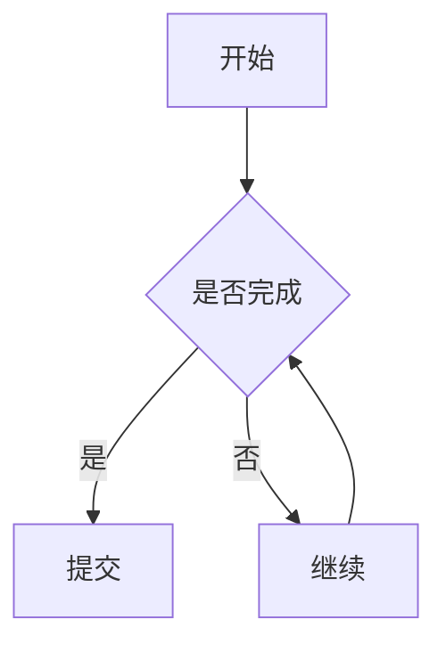
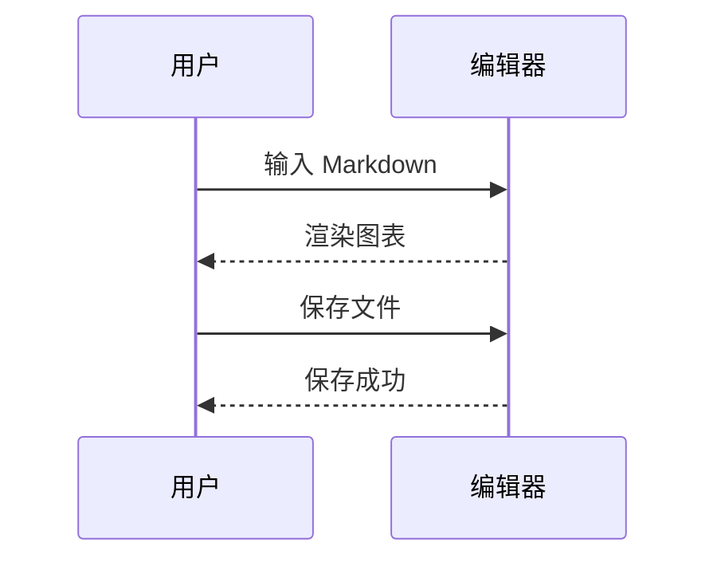
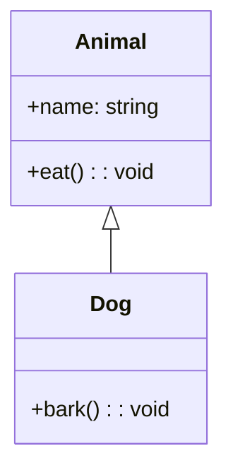
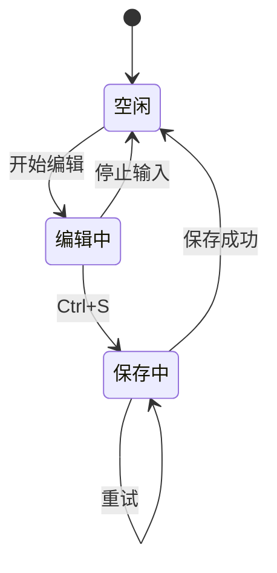
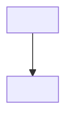

# Mermaid Diagram Test Cases

## 1. Flowchart



## 2. Sequence Diagram



## 3. Class Diagram



## 4. State Diagram



## 5. Mermaid 语法错误（应显示错误不崩溃）

```mermaid
flowchart TD
  A --> B
  B -->>
```

## 6. 非 mermaid 代码块（应继续高亮）

```mermaidx
flowchart TD
  A --> B
```

```ts
const foo = "not mermaid";
```

## 7. 包含尖括号的 mermaid 代码（安全验证）


